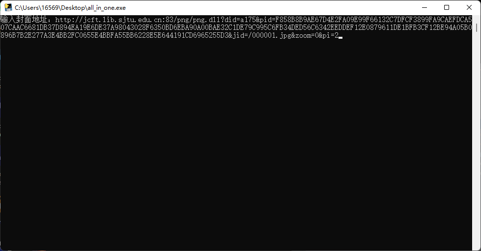

# SJTU-BookDownloader
某位SJTU本科生为快速便捷下载图书馆资源而写的程序

- [x] 下载图书的图片并合成PDF
- [x] 使用教程
- [ ] 多线程加速下载
- [ ] 图形界面
## 使用教程

### 下载
建议在右侧直接下载release，不用在本地配置环境

### 使用
 首先你需要连接到校园网或者VPN，然后进入你要的图书的浏览界面，
 这时在Microsoft Edge浏览器或者Google Chrome中按下F12，
 并刷新页面，选中右侧网络一栏：
 

 然后在左侧栏找到那个以 `http://jcft.lib.sjtu.edu.cn:83/png/png.dll?did=a175&pid=`
 开头的一行
 

右键那一行，点击复制/复制链接地址

之后打开 `all_in_one.exe` ，直接右键点击窗口，粘贴刚才的链接

回车即可，之后下载完毕会保存在程序相同目录的 `saved` 文件夹内。